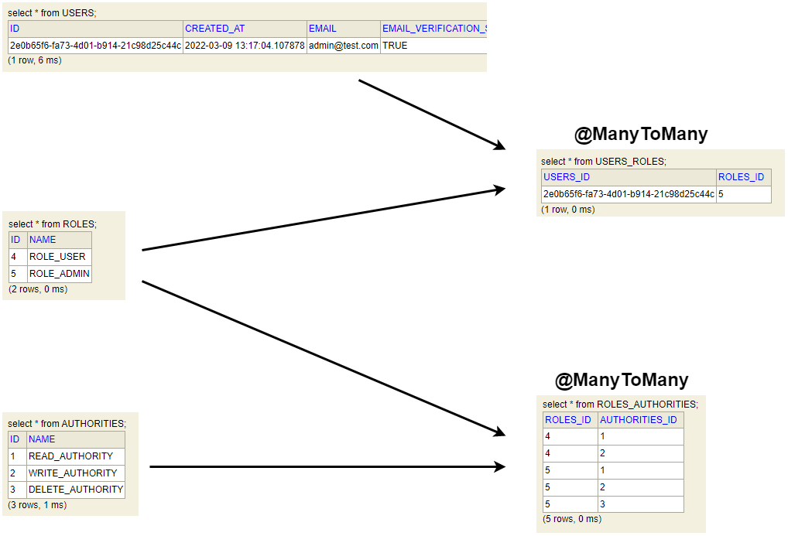

# RESTful Web Services, Java, Spring Boot, Spring MVC and JPA

Swagger documentation http://localhost:8088/swagger-ui/index.html 
You will be able to see swagger only when you use `dev` profile. You can set this value inside the IDE 
or when you run the application using the terminal, append also the following command `--spring.profiles.active=dev`

## Roles and Authorities

 